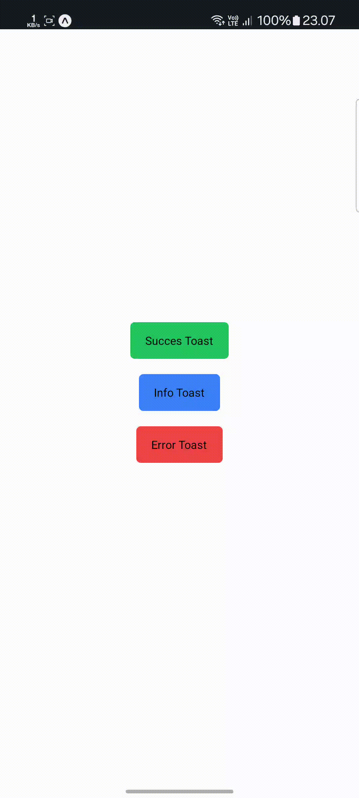

# @masumdev/rn-toast

[](https://badge.fury.io/js/@masumdev%2Frn-toast)

A simple toast for React Native, inspired by Samsung notifications. This library provides a lightweight toast component with smooth animations and anti-spam protection, ensuring a seamless user experience.

## Demo

<p align="center">
  
  
</p>

### Tutorial Video
<p align="center">
  <a href="https://www.youtube.com/watch?v=ytdpXMd1fqU" target="_blank">
    
  </a>
</p>

*Demo showing various toast notifications: success, error, and info types with smooth animations and anti-spam protection*

## Features

- 🚀 Lightweight and performant
- 🎨 Customizable styling
- 🔄 Animation using React Native Reanimated
- 📱 Works on iOS and Android
- 📚 TypeScript support
- 🧠 Smart queueing system for multiple toasts

## Installation

```bash
npm install @masumdev/rn-toast
# or
yarn add @masumdev/rn-toast
# or
pnpm install @masumdev/rn-toast
# or
bun add @masumdev/rn-toast
```

### Dependencies

This package requires the following peer dependencies:
- `react-native-reanimated` >= 2.0.0

Make sure to follow the [react-native-reanimated installation instructions](https://docs.swmansion.com/react-native-reanimated/docs/fundamentals/installation).

## Usage

### Basic Setup

1. Add the `Toaster` component to your app's root component:

```jsx
import React from 'react';
import { View } from 'react-native';
import { Toaster } from '@masumdev/rn-toast';

export default function App() {
  return (
    <View style={{ flex: 1 }}>
      <Toaster />
      {/* Your app content */}
    </View>
  );
}
```

2. Use the `useToast` hook in your components:

```jsx
import React from 'react';
import { Button, View } from 'react-native';
import { useToast } from '@masumdev/rn-toast';

export default function MyComponent() {
  const { showToast } = useToast();

  const handlePress = () => {
    showToast('Operation successful!', 'success');
  };

  return (
    <View>
      <Button title="Show Toast" onPress={handlePress} />
    </View>
  );
}
```

### Toast Types

The library supports three types of toasts:
- `info` (default)
- `success`
- `error`

```jsx
// Show an info toast
showToast('This is an info message');

// Show a success toast
showToast('Operation successful!', 'success');

// Show an error toast
showToast('Something went wrong', 'error');
```

### Customization Options

You can customize the duration and animation speed:

```jsx
// Custom duration (8 seconds)
showToast('This will stay longer', 'info', { duration: 8000 });

// Custom animation speed (200ms)
showToast('Quick animation', 'success', { animationDuration: 200 });
```

### Customizing the Toaster Component

You can customize the default behavior of the Toaster component:

```jsx
import React from 'react';
import { View } from 'react-native';
import { Toaster } from '@masumdev/rn-toast';

export default function App() {
  return (
    <View style={{ flex: 1 }}>
      <Toaster
        defaultDuration={3000} // 3 seconds default duration
        defaultAnimationDuration={300} // 300ms animation
        customIcons={{
          success: require('./assets/my-success-icon.png'),
          error: require('./assets/my-error-icon.png'),
          info: require('./assets/my-info-icon.png')
        }}
        customColors={{
          success: { background: '#e6ffe6', text: '#006600' },
          error: { background: '#ffe6e6', text: '#cc0000' },
          info: { background: '#e6f2ff', text: '#0066cc' }
        }}
      />
      {/* Your app content */}
    </View>
  );
}
```

### Manual Toast Control

You can manually hide toasts using the `hideToast` function:

```jsx
import React from 'react';
import { Button, View } from 'react-native';
import { useToast } from '@masumdev/rn-toast';

export default function MyComponent() {
  const { showToast, hideToast } = useToast();

  const showMessage = () => {
    showToast('This is a long toast message...', 'info', { duration: 10000 });
  };

  const hideMessage = () => {
    hideToast(() => {
      console.log('Toast was dismissed');
    });
  };

  return (
    <View>
      <Button title="Show Toast" onPress={showMessage} />
      <Button title="Hide Toast" onPress={hideMessage} />
    </View>
  );
}
```

## License

MIT


## Author

**Ma'sum** - *React Native Developer from Indonesia*

I'm a React Native developer passionate about creating smooth and performant mobile applications. This toast library is part of my commitment to the React Native community, providing simple yet powerful solutions for common UI needs.

- 📱 React Native Developer
- 🇮🇩 Based in Indonesia
- 🔧 Focused on building reusable and performant components
- 💻 Open source contributor

Feel free to reach out for questions, suggestions, or collaborations!

---
Built with ❤️ in Indonesia